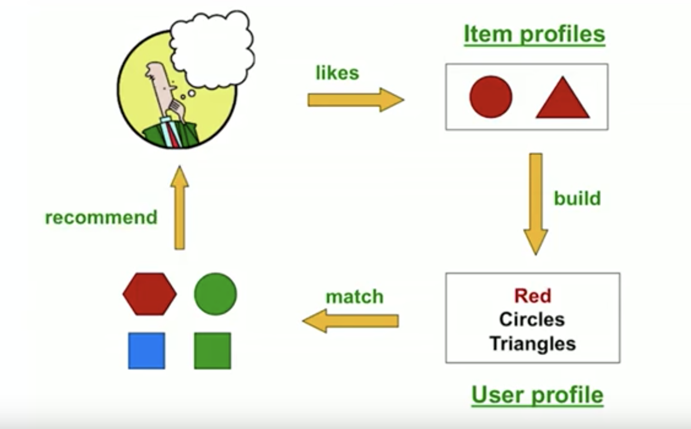
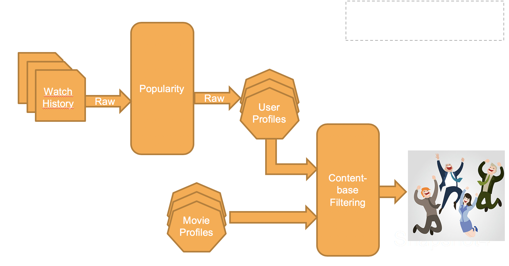

# Movie Strand Recommendation

 The basic ideas is if a customer watched one movie, mean
 There are two most popular recommendation algo **content-based filtering** and ***Collaborative filter***.

* ***How is content-based Filter working***?
    

* ***Current Flow***
    
* ***New Flow***

    

